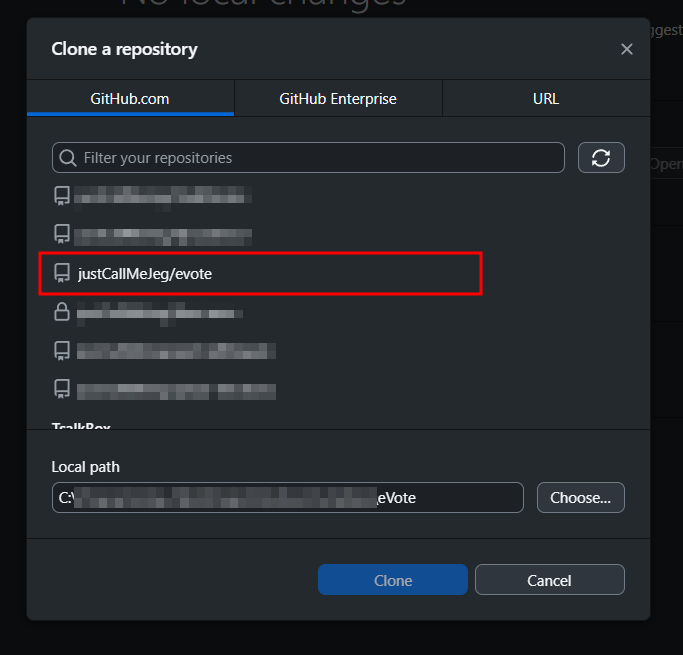

# Installation

Before we start, you need to install the prerequisites to your local machine. Select what platform fits best to your current situation.

Global Prerequisites:

* [Node.js](https://nodejs.org/) (<18.4.0)
* [Visual Studio Code](https://code.visualstudio.com/) Editor
  * [VS Code ES7+ React/Redux/React-Native/JS](https://marketplace.visualstudio.com/items/?itemName=dsznajder.es7-react-js-snippets) Extension
  * [JavaScript and TypeScript Nightly](https://marketplace.visualstudio.com/items/?itemName=ms-vscode.vscode-typescript-next) Extension
  * [Material Icon Theme](https://marketplace.visualstudio.com/items/?itemName=PKief.material-icon-theme) Extension (Optional)
* [Git](https://git-scm.com/)

To get started, you need to clone the project's repository using the following methods.

<details>

<summary>GitHub Desktop (Recommended)</summary>

This is the recommended way to clone the project's repository if you wish to avoid complex CLI commands.


Make sure that the GitHub Desktop is already installed to your machine. If not, visit [this page](https://github.com/apps/desktop) for more information.


Open GitHub Desktop then click the `Add` button. A dropdown will appear and select `Clone repository...`.&#x20;

If you are a contributor, you can login to your GitHub Account and select the project's repository under the GitHub.com tab.&#x20;

<figure><figcaption><p>Cloning a Repository using GitHub Account</p></figcaption></figure>

If not, you can input `https://github.com/justCallMeJeg/evote.git` instead under the URL tab.

<figure><figcaption><p>Cloning a Repository using HTTPS</p></figcaption></figure>


Make sure to install the project's repository to your desired location.


Or... alternately, you can visit the [GitHub Page](https://github.com/justCallMeJeg/evote) of the project repository. Click the `Code` button then click `Open with GitHub Desktop` .


Your browser may prompt you to open the GitHubDesktop.exe, just click `Open GitHubDesktop.exe` button.


After successfully installing the project's repository, you can now open it on Visual Studio Code by  typing `Ctrl` +`Shift`+`A` .

</details>

<details>

<summary>GitHub CLI</summary>

If you prefer to use GitHub's CLI, you can do the following:


Make sure that the GitHub CLI is already installed to your machine. If not, visit [this page](https://github.com/cli/cli#installation) for more information.


Access the desired directory where you want to install the project's repository, then type:

```bash
gh repo clone justCallMeJeg/evote
```

After successfully installing the project's repository, you can now open it on Visual Studio Code by  running  the `code .` command.

</details>

Once the repository is installed to your local machine, you can now [run the application locally](running-the-project-locally.md).
